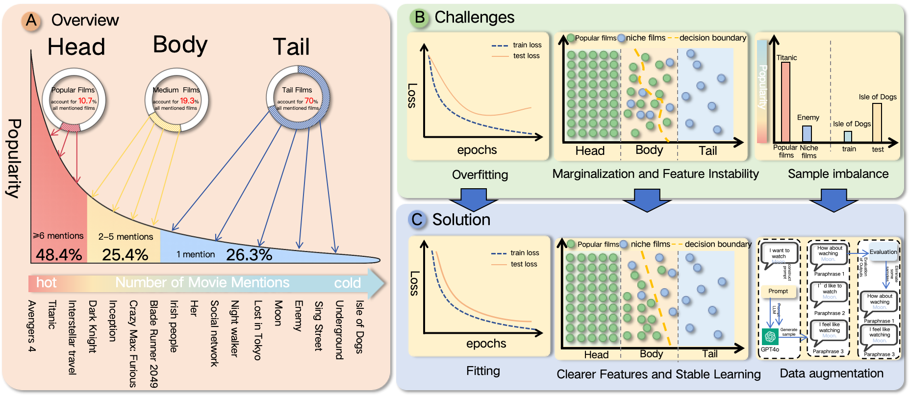
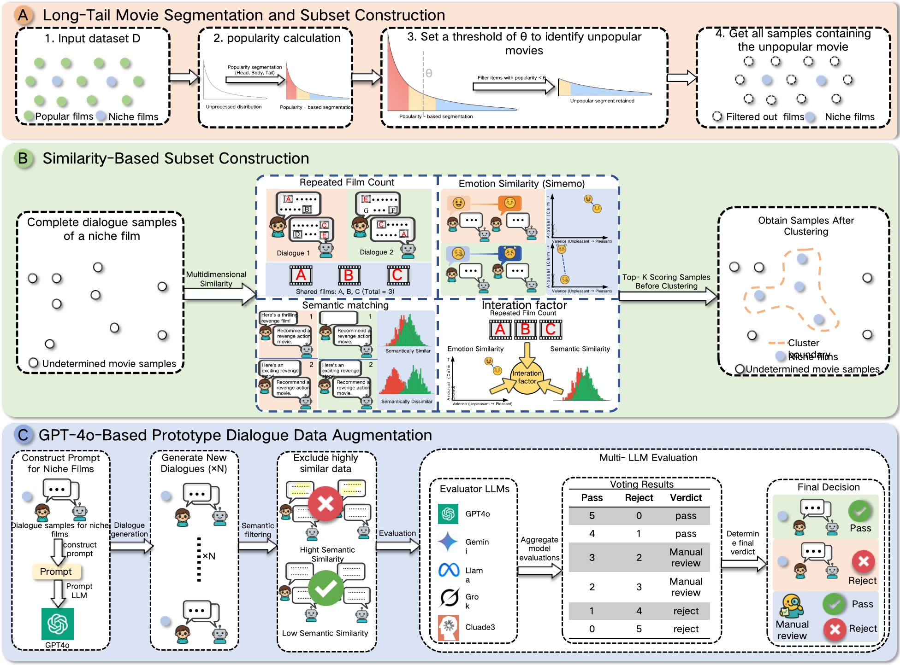
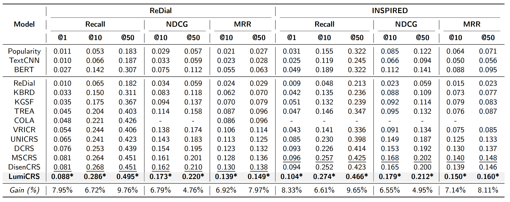

<h3>LumiCRS: Asymmetric Contrastive Prototype Learning for Long-Tail Conversational Recommender Systems</h3>

[Jinzhi Wang](https://github.com/Jinzhi-Wang)1&nbsp;
Bin Li2&nbsp;
Qingke Peng1*&nbsp;
Haozhou Li1&nbsp;
eyuan Zeng1&nbsp;
Ruimeng Li1&nbsp;
 
Kaixuan Yang3&nbsp;
Jiangbo Zhang4&nbsp;
Yaoying Wang5&nbsp;
Biyi Zhou4&nbsp;

1 Organizational Management Department, School of Management, Xi’an Jiaotong University&nbsp; 
 
2 Shenzhen Institute of Advanced Technology, Chinese Academy of Science&nbsp; 
 
3State Key Laboratory of Multiphase Flow in Power Engineering, School of Energy and Power Engineering, Xi’an Jiaotong University&nbsp; 
 
4School of Electronic Science and Engineering, Xi’an Jiaotong University&nbsp;
 
5chool of Software, Xi’an Jiaotong University&nbsp; 
 

  

The following figure illustrates the motivation and design of LumiCRS. On the left (A), we highlight the long-tail distribution in conversational recommendation, where head-class movies dominate, while tail items are severely underrepresented. This causes three major challenges: (1) training loss is dominated by frequent items, leading to overfitting; (2) mid-/tail representations are unstable and poorly clustered; (3) train-test distribution mismatch limits generalization.

To address these issues, LumiCRS introduces three key components (see C):

* **ACFL (Adaptive Contrastive Focal Loss):** balances overall accuracy and head-class suppression;

* **Prototype-based Contrastive Learning:** improves semantic robustness for mid-/tail items;

* **Prototype-driven Augmentation (PDA):** generates diverse and relevant contexts for tail enhancement.

Together, these modules form a robust framework tailored for long-tail and cold-start challenges in conversational recommendation.

## TO DO
- [ ] Release full LumiCRS codebase (training & inference) .
- [ ] Publish pretrained models and benchmark results .
- [ ] Add documentation and quick-start tutorials

## What is LumiCRS?
LumiCRS is a robust and generalizable conversational recommender system, specifically designed to handle long-tail movie recommendation challenges in real-world dialogue settings. It is distinguished by the following core components: 
* **Adaptive Loss for Bias Mitigation:** LumiCRS introduces the Adaptive Contrastive Focal Loss (ACFL) to simultaneously suppress head-class overfitting and improve tail item exposure, aligning with popularity-aware fairness constraints.
* **Prototype-based Contrastive Learning:**  A novel prototype learning module is designed to stabilize mid-/tail movie representations by semantically clustering similar items. It enhances representation quality, especially for under-represented entities.
* **Prototype-Driven Augmentation (PDA):** LumiCRS constructs an intelligent data augmentation framework that dynamically generates diverse and contextually relevant dialogues for low-frequency movies using prototype-guided sampling.
With these modules, LumiCRS enables accurate, balanced, and diverse recommendations under sparse and skewed data distributions.
 
 

  >

  <em style="font-size: 12px;">
*Comparisons between OctoNav-Bench and previous benchmarks.* NT denotes the task number. Mixed indicates whether a single instruction integrates multiple capabilities. Modality is the modality within instructions, where [V,L,P] denote [vision, language, point]. TBA presents the think-before-action annotations. DE, CE denote the discrete and continuous environments.
  </em>

## Benchmarking LumiCRS: Recommendation Accuracy, Long-Tail Coverage, and Response Quality

* **Overall Recommendation Accuracy (Recall/NDCG/MRR):** Table 1 shows the overall recommendation performance of LumiCRS compared to previous state-of-the-art methods on ReDial and INSPIRED datasets. LumiCRS consistently outperforms all baselines across multiple ranking metrics including Recall@K, NDCG@K, and MRR@K. Notably, LumiCRS achieves an average of +7.95%, +6.72%, and +9.76% gain in Recall@1/10/50 on ReDial. On INSPIRED, it yields an average +8.33%, +6.61%, and +9.65% improvement in the same metrics, demonstrating its strong recommendation accuracy.

  

* **Long-Tail Recommendation & Diversity:** Table 2 evaluates the ability of LumiCRS to recommend niche (tail) items, covering TailRecall@K, Coverage@K, and ILD@K. LumiCRS demonstrates substantial improvements in long-tail performance, particularly with +14.29% TailRecall@1 and +11.76% TailRecall@50 on ReDial, and similar trends on INSPIRED. Meanwhile, it maintains broader item coverage and diversity (ILD), highlighting its strength in addressing popularity bias and enriching recommendations. 

  

* **Response Generation Quality:** Table 3 compares LumiCRS with generation-based models on language quality metrics including BLEU, ROUGE, and Distinct (DIST). LumiCRS achieves the highest scores across almost all metrics, such as BLEU-2/3, ROUGE-L, and Distinct-2/3/4, indicating both accurate and diverse natural language generation. This reflects the model’s ability to generate more fluent, informative, and stylistically varied responses.

  

